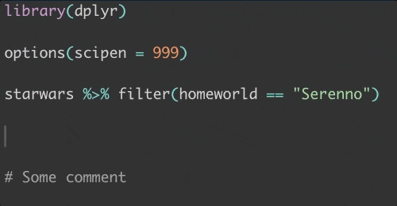
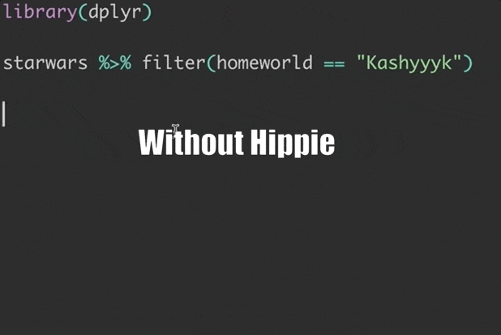
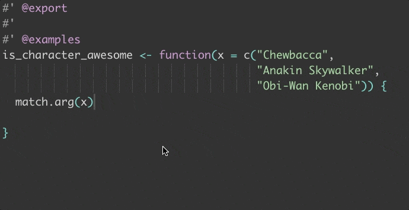
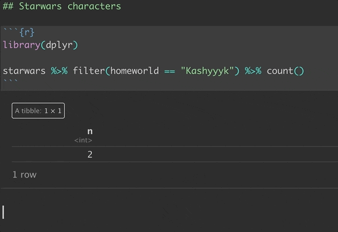
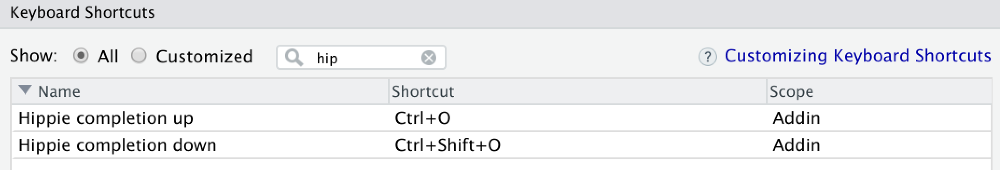

<p align="center">
  
</p>

---

<a href="https://github.com/crew102/hippie/actions/workflows/check-standard.yaml">
  
</a>
<a href="https://cran.r-project.org/package=hippie">
  
</a>



**An RStudio addin for Hippie Code Completion**

* **Speed.** Hit fewer keystrokes in getting the word you want
* **More completions in R.** Extends completions to string comments, string literals, and all throughout Roxygen blocks
* **Completions outside R.** Get completions in files where you otherwise can't - .yml, .txt, .md, etc.

## About

Hippie's a completion engine that looks in your active source file for words to suggest. This differs from traditional completion in RStudio, which is more focused on using the R execution environment for identifying suggestions. Using both completion methods allows you to supercharge your RStudio experience.

<h2>
  <a name="why"></a>
  Why Hippie?
</h2>

* **Speed.** Often times the word you want appears right around your cursor, or you know you've used it recently in your current file. `hippie` allows you to use this knowledge to provide a more relevant list of suggestions than what traditional code completion would offer. For example, with traditional completion I have to type 5 characters before `starwars` appears as the first suggestion, and 4 characters before `filter` appears as the first suggestion. With Hippie, it's 1 character each.

<p align="center">
  
</p>

<ul>
<p>
Even in larger files, you usually only need to type one or two characters before invoking the Hippie shortcut, and the first suggestion will be the one you want.
</p>
</ul>

* **Completions everywhere.** Hippie works in areas where normal autocomplete doesn't. In R code, you can get completions in literals, comments, and everywhere in your Roxygen blocks.

<p align="center">
  
</p>

<ul>
<p>
Hippie also extends to all file types, including text files, markdown, config files, etc. You can even get completions in the text sections of RMarkdown docs.
</p>
</ul>

<p align="center">
  
</p>

## Installation

* Install the R package. You can get the stable version from CRAN with:

  ``` r
  install.packages("hippie")
  ```

  ...Or the development version with:

  ``` r
  # install.packages("devtools")
  devtools::install_github("crew102/hippie")
  ```

* Restart RStudio. RStudio will automatically detect the `hippie` addin moving forward.

* Add a shortcut. 

  * Go to *Tools*, then *Modify Keyboard Shortcuts*. Search for hippie, and you should see something like this:
  
<p align="center">
  
</p>

<ul>

  * You can add a shortcut for both up and down, which refers to the direction hippie will look for the next matching token (above or below the cursor). You only need to use one direction, as hippie will cycle from the bottom to the top of the document and vice versa, but it can be faster if you know which direction to move next.
  
  * Type whichever keys you want to use for the shortcut in the *Shortcut* box, then hit *Apply*. Hippie Completion will now work whenever you're in an RStudio editor (no need to call `library(hippie)`).
  
</ul>

<h2>
<a name="credits"></a>
Thanks to 
</h2>

* Anders Holst, the creator of Hippie Expand in Emacs, both for the original idea of Hippie Completion and also for the fun name. According to Holst:

  > I came up with this try-function idea that tries one kind of expansion at a time, and lets the user press repeatedly to sequence through the alternatives. I called it Hippie Expand to signal that it's completely unrealistic, dreaming, kind of high. I was entirely convinced that it would not work in practice - that it would be necessary to press endlessly on the key it was bound to before the wanted expansion would show up.

* [PyCharm's implementation of hippie](https://www.jetbrains.com/help/pycharm/auto-completing-code.html#hippie_completion), which inspired this package

* [starship](https://github.com/starship/starship), whose README style I blatantly ripped off

<h2>
<a name="learning"></a>
Learning more
</h2>

* Learn about [`hippie.mode`](https://github.com/crew102/hippie/wiki/hippie.mode)
* Check out the [new features](https://support.rstudio.com/hc/en-us/articles/205273297-Code-Completion-in-the-RStudio-IDE) in the native RStudio code completion engine
* Random bonus feature - [easy debugging of pipped expressions](https://github.com/crew102/hippie/wiki/Debugging-pipped-expressions)
